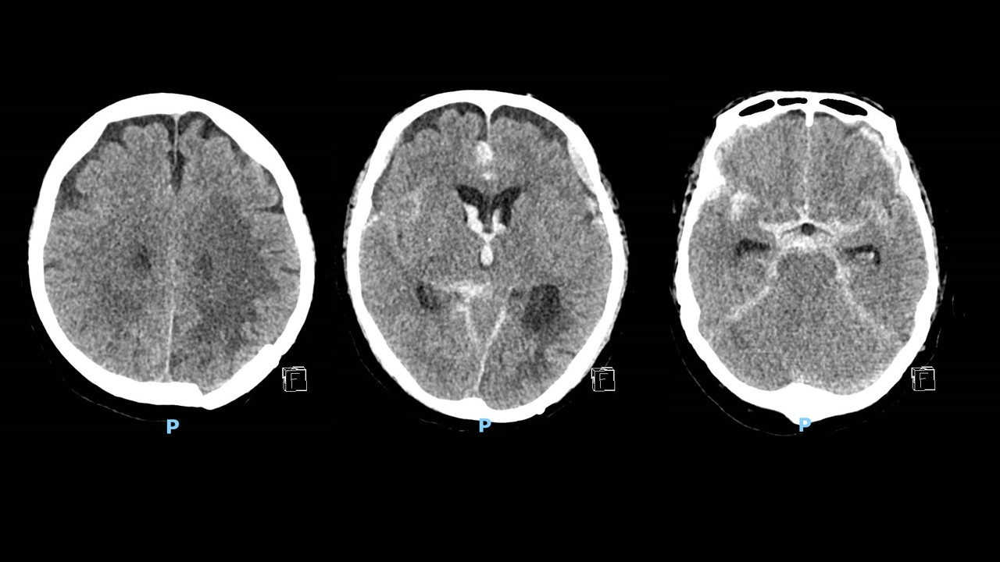
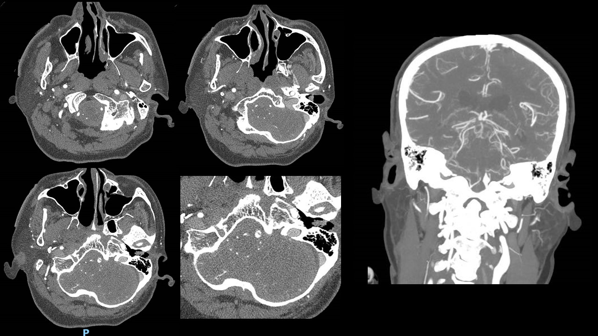

## Case 2: 65 YO M with a history of mild headache since morning who became unresponsive

### Synopsis
65 YO M with no significant PMHx who woke up with mild headache which persisted throughout the day. He developed a sudden severe neck pain. EMS was called. Per EMS, his SBP was
270.He became unresponsive en route to the hospital. Stroke code was activated. In the ED, he was unresponsive, his eyes were open, no blink to threat, corneal reflex -ve, VOR -ve.
On the way to CT scan, he had a PEA cardiac arrest s/p CPR with ROSC in 3 minutes. ECG showed ST elevation in aVR and diffuse T-wave inversions. 

### Questions

- What are your top differential diagnosis? 
- You still don't have CT head as the team is resuscitating him. What would you do at this moment? Who would you talk to? 
- The ED team is trying to get hold of the cardiology team. Would you wait for cardiology or proceed with stroke code? 

### Imaging

Finally, the patient is stable and cardiology has arrived at the bedside. They are going over ECG. You ask the team to take the patient to CT:

The CT technician, been waiting for almost 30 minutes to do the scan, is asking the nurse to take the patient off the table. However, you ask the technician to proceed with CTA:

### Questions

- What would you do and who would you talk to at this point?
- How would you proceed with admitting this patient? 
- Patient's family is in the waiting room. What would you tell them? 
