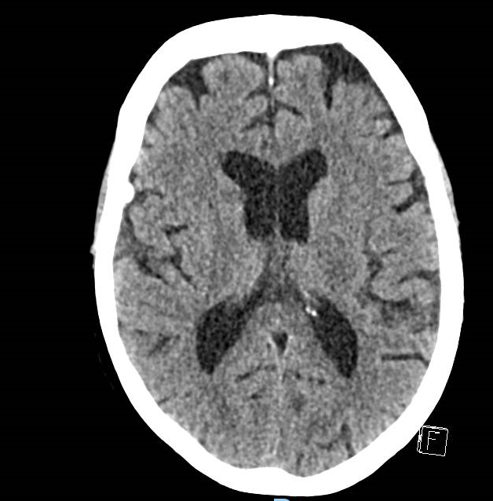
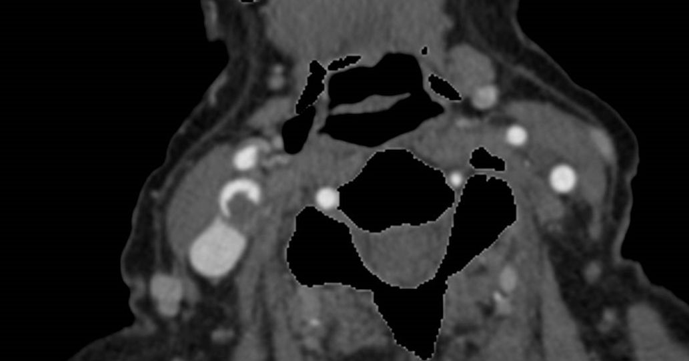
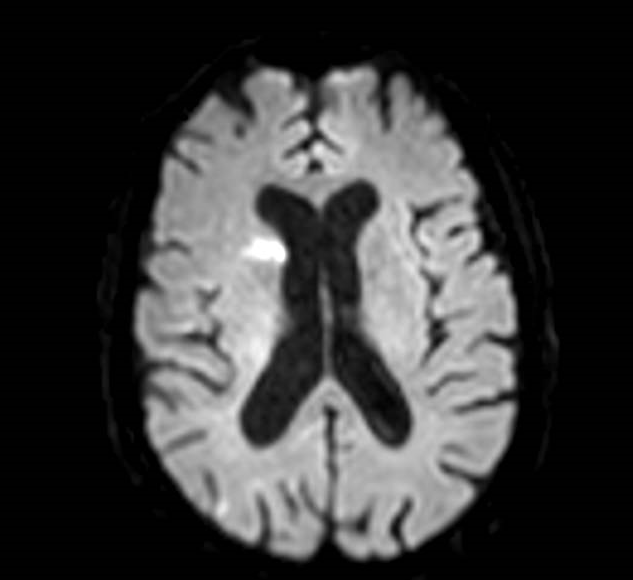
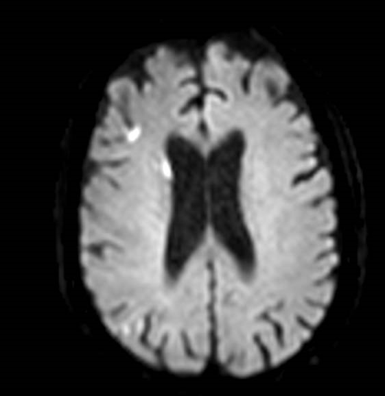
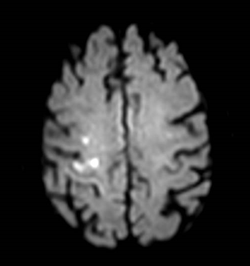

## Case 1: 80 YO F with Acute-Onset Left Facial Droop and Hand Weakness

### Synopsis
79 year old female with hx of atrial fibrillation (not on AC) admitted to the hospital for colon cancer s/p colectomy who had an acute onset left facial droop and left hand weakness. 
NIHSS was 1 for minor facial droop. No upper extremity drift but finger extension and flexion 4/5, wrist extension 5/5.

### Stroke Code Imaging

 
<b>CT head</b>

 

 

Given that the NIHSS is 1, you are not sure if you want to proceed with CTA head and neck at this point.You ask the primary team to check her most recent creatinine which is 0.5. You proceed with CTA to call it the day. 

 
<b>CTA Head and Neck</b>

 

 
 

### Questions
- What would you do at this point?
  - What treatment would you start? 
  - Who would you talk to? 
  - What recommendations would you give? 

### Brain MRI
Brain MRI was done within 3 hours after stroke code. 

 

 

 
 

### Questions
- How does the new MRI findings change your management? 
